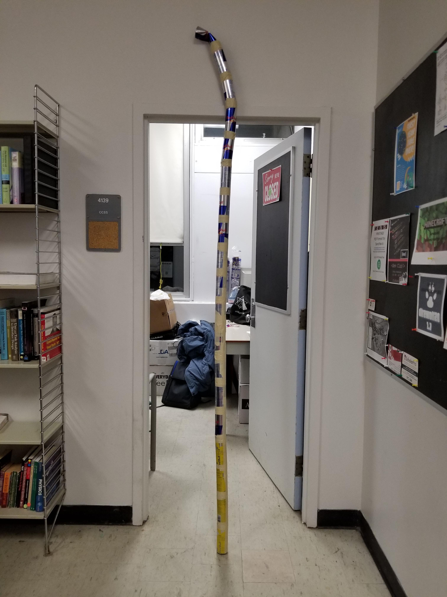

# Team: Energy Crook
Members: Aidan Crowther, Christian Belair, Adam Payzant, Kelvin Ratsamany

Github: https://github.com/aidancrowther/CUHacking-2020/

## Butterfly Identifier:
    - The main project we focused on. Uses a neural network to indetify butterflies found in the Butterfly Exhibit at Carleton. It requires the user to take a picture of the butterfly, and it will bring up the name and information of it. Butterfly information is stored serverside using MongoDB.
    - Competitions: Top Three, Best UI/UX
    
## Google Images Scrapper:
    - A scrapper for Google Images. Google fought us a lot for this one. Made to get the training set for the butterfly identifier.
## Energy Crook:
    - We just kinda did this one, sorry
